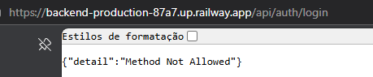

---

## ✅ Funcionalidades Implementadas

### 🔐 Autenticação
- Login com CPF + Senha (com hash de segurança)
- Cadastro de novos usuários com validação de CPF e confirmação de senha
- Sessão persistente via localStorage
- Controle de acesso por perfil (Administrador, Gestor, Usuário)
- Alteração de senha

**Usuário Admin padrão:**
- CPF: `727.927.369-68`
- Senha: `admin123`

### 📊 Dashboard
- KPIs: Competências, Ações Educativas, Trilhas, Usuários
- Gráficos interativos (Chart.js):
  - Distribuição por Eixo Funcional
  - Tipologia de Complexidade (Básico/Intermediário/Avançado)
  - Categorias (Especialista vs Geral)
  - Competências por Cargo
  - Top 8 Unidades Temáticas
- Feed de atividades recentes

### 📋 Matriz de Competências (MCN 2026)
- **602 registros** pré-carregados
- Tabela paginada (15/página) com busca e filtros por:
  - Categoria, Subcategoria, Cargo, Eixo Funcional, Complexidade, Ano da Matriz
- Modal de detalhes completo
- CRUD completo (Admin/Gestor)
- Exportação para CSV

### 📚 Ações Educativas
- Formulário com **27 campos** em 4 seções (Identificação, Detalhamento, Operacional, Certificação)
- **6 cursos pré-carregados**: III Interseccionalidade, VI Fontes Humanas, II Revista Eletrônica, II Políticas Penais, V CAP, II Entrevista
- Visualização em cards com filtros
- Modal de detalhes completo
- CRUD completo (Gestor/Admin)

### 🛤️ Trilhas de Aprendizagem
- Criação de trilhas vinculando ações educativas
- Filtros por cargo, eixo, nível
- Visualização em timeline
- Carga horária calculada automaticamente
- CRUD completo

### 📝 Planos de Ensino
- Vinculação por servidor + trilha
- Controle de progresso com checkboxes por ação
- Progresso calculado automaticamente
- Status automático (Em andamento/Concluído)
- Datas de início e meta

### 👥 Gestão de Usuários (Admin only)
- Listagem completa de usuários
- Cadastro, edição e ativação/desativação
- Controle de níveis de acesso

### ⚙️ Configurações
- Perfil do usuário logado
- Estatísticas do sistema
- Reinicialização de dados (Admin)

---

## 🗂️ Estrutura de Dados (localStorage)

| Chave | Descrição | Volume |
|-------|-----------|--------|
| `espen_users` | Usuários do sistema | ~3 iniciais |
| `espen_session` | Sessão ativa | 1 registro |
| `espen_matriz` | Matriz de Competências MCN 2026 | 602 registros |
| `espen_acoes` | Ações Educativas | 6 iniciais |
| `espen_trilhas` | Trilhas de Aprendizagem | 0 iniciais |
| `espen_pdi` | Planos de Ensino | 0 iniciais |

---

## 📁 Arquivos

```
index.html    — Aplicação completa (SPA, CSS e JS inline)
README.md     — Esta documentação
```

---

## 🚀 Acesso


criar um ambiente Python virtual antes de testar o backend.
cd backend
python -m venv .venv
.\.venv\Scripts\Activate.ps1
pip install -r requirements.txt
copy .env.example .env

uvicorn app.main:app --reload --host 0.0.0.0 --port 8001


Arquivo único `index.html` — abra diretamente no navegador ou publique via aba **Publish**.


## 🗄️ Backend FastAPI + PostgreSQL

Agora o projeto também suporta persistência em banco PostgreSQL, com API FastAPI.

### Subir banco

```bash
docker compose up -d postgres
```

### Rodar API

```bash
cd backend
python -m venv .venv
.venv\Scripts\activate
pip install -r requirements.txt
copy .env.example .env
uvicorn app.main:app --reload --host 0.0.0.0 --port 8001
```

### Rodar frontend

```bash
npm run start
```

Com frontend em `http://127.0.0.1:5500` e API em `http://127.0.0.1:8001`, os dados passam a ser persistidos no PostgreSQL via API.

---

## 🔧 Próximos Passos Sugeridos

1. **Exportação PDF** de Planos de Ensino e relatórios gerenciais
2. **Relatório de gap analysis** por servidor (competências requeridas vs desenvolvidas)
3. **Importação via CSV/Excel** para a Matriz de Competências
4. **Notificações de prazo** nos Planos de Ensino
5. **Módulo de avaliação**: aplicar avaliações de aprendizagem pós-ação
6. **Integração com SIAPE/SOUGOV** para dados de servidores
7. **Backup/restore** de dados em JSON
8. **Multitenancy**: suporte a múltiplos estados
